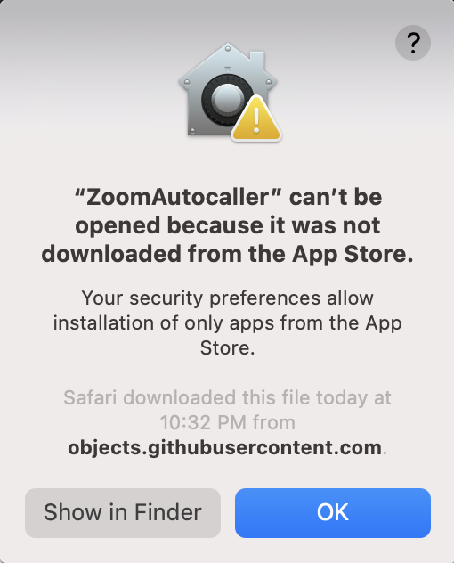
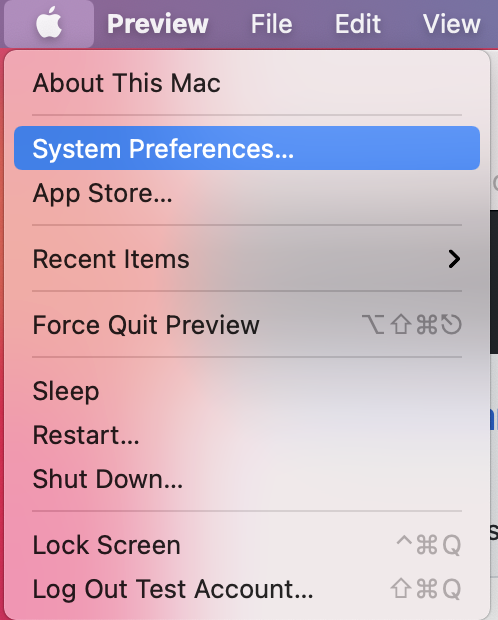
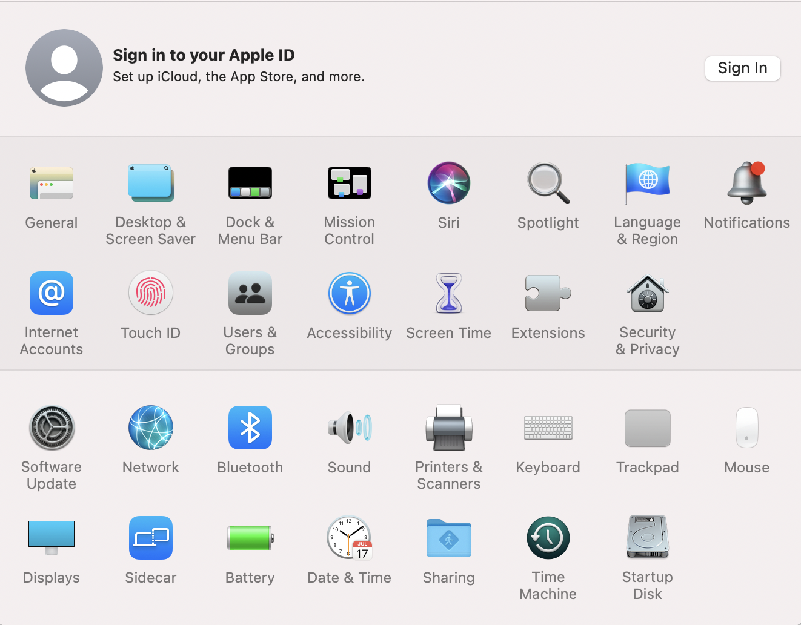
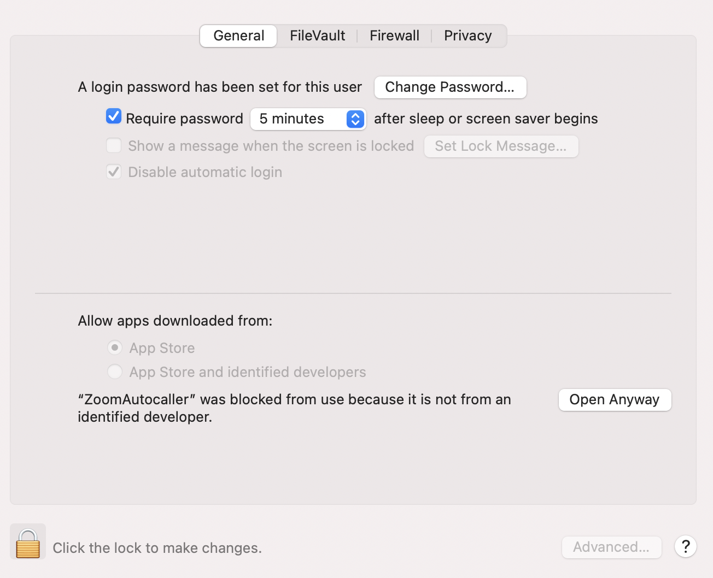
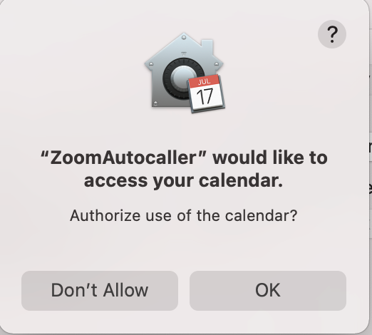
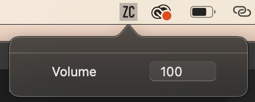

# Installation Instructions

Step 1: Download the .zip file from the Releases page and extrat
Step 2: Open the .app file that gets extracted from the zip folder.
Step 3: If the following screen shows up, do the following tasks, otherwise skip to step 9

Step 4: Open System Preferences

Step 5: Open Security & Privacy

Step 6: Once you get into Security & Privacy, click on the lock icon to unlock and enter in your credentials

Step 7: Once that is done, click the open anyway button next to the ZoomAutocaller message

Step 8: Try opening the downloaded ZoomAutocaller file again

Step 9: The app will ask for permission to read your calendar, click ok

Step 10: Everything should be working!  The utility icon should be in your toolbar.  Click on the icon to set your volume.

