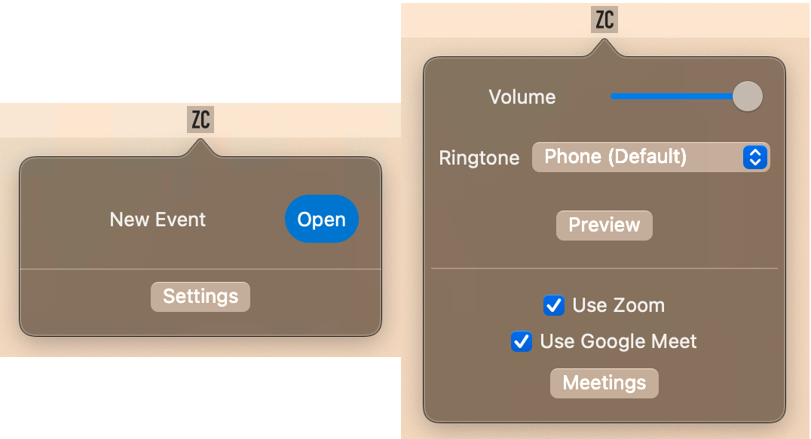

#  ZoomAutocaller

This is a simple toolbar utility that will render a dropdown and play a ringtone when a meeting with a zoom link is scheduled to occur.  Uses the Apple Calendar API's

## Releases

- **0.0.5** - Fixes sound not playing.  Also fixes improper link seaching.
- **0.0.4** - Fixes note field causing program to crash
- **0.0.3** - Fixes some events not getting picked up.  Fixes sound not playing at times
- **0.0.2** - Adds some QOL items. Fixes sound not stoping when minimizing prompt window.
- **0.0.1** - Inital release.  Really rough looking code 😧
